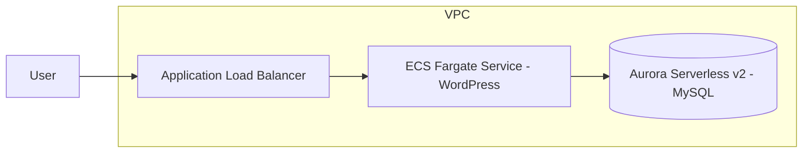

# Serverless WordPress on AWS  
(ECS Fargate + ALB + Aurora Serverless v2) with Terraform

Terraformを用いて、ECS Fargate + ALB + Aurora Serverless v2 構成で  
WordPressをデプロイするサンプルプロジェクトです。

オンプレミス基盤運用経験をベースに、AWS上で再現性のある構成を  
Infrastructure as Codeで構築できることを目的としています。

---

## Architecture



---

## Key Features

- Infrastructure as Code with Terraform
- ECS Fargate for container runtime (no EC2 management)
- Aurora Serverless v2 for auto-scaling database layer
- ALB as public entry point
- Database deployed in private subnets
- Security Group restricts DB access to ECS only

---

## Repository Structure

```
aws-serverless-wordpress/
  envs/
    dev/
  modules/
    vpc/
    alb/
    ecs_fargate/
    aurora_serverless_v2/
    ecr/
```

---

## Prerequisites

- Terraform >= 1.6
- AWS CLI configured (`aws configure`)
- Region: ap-northeast-1 (Tokyo)

---

## Deploy (dev environment)

⚠️ terraform.tfvars や tfstate は GitHub にコミットしないでください。

```bash
cd envs/dev
cp terraform.tfvars.example terraform.tfvars
# terraform.tfvars の db_master_password を変更

terraform init
terraform plan
terraform apply
```

---

## Verification

Terraform outputs に表示される `alb_dns_name` をブラウザで開きます。

Expected Result:

- WordPress language selection screen is displayed
- ALB → ECS → Aurora connectivity confirmed

---

## Design Decisions

### Why Fargate?
- EC2のパッチ管理・容量管理を不要にする
- 運用負荷を最小化

### Why Aurora Serverless v2?
- 需要変動に応じてACUが自動スケール
- MySQL互換で扱いやすい

### Why ALB?
- ECSとの統合が容易
- L7ロードバランサとして標準的構成

---

## Future Improvements

- ECSをprivate subnet + NAT構成へ移行
- Secrets ManagerでDBパスワード管理
- CloudFront + WAF 追加
- ログ設計（ALB access log / CloudWatch Logs）

---

## Clean Up

```bash
cd envs/dev
terraform destroy
```

---

## Author

Tomomasa Sekino  
GitHub: TomomasaSekino